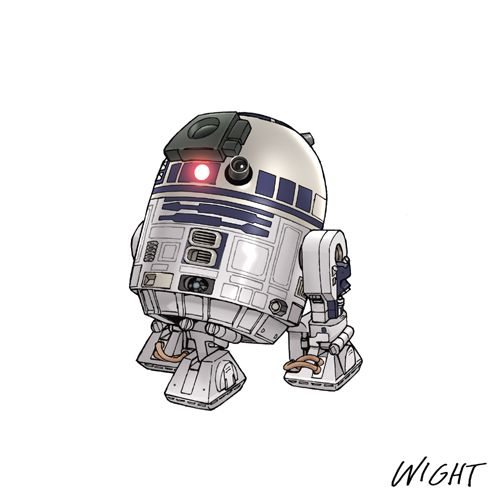

# the-droid-project

the initial setup was done using the follow instruction

https://www.instructables.com/Raspberry-Pi-Wifi-Video-Streaming-Robot/

## R2-D2 referance image

This project was created using the following :

<!--  -->
